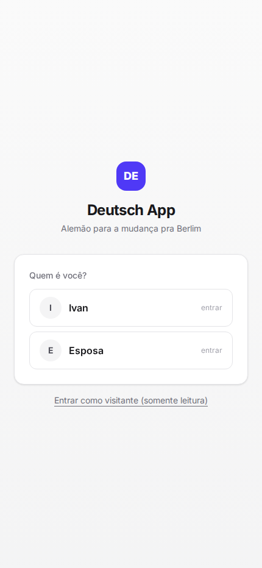
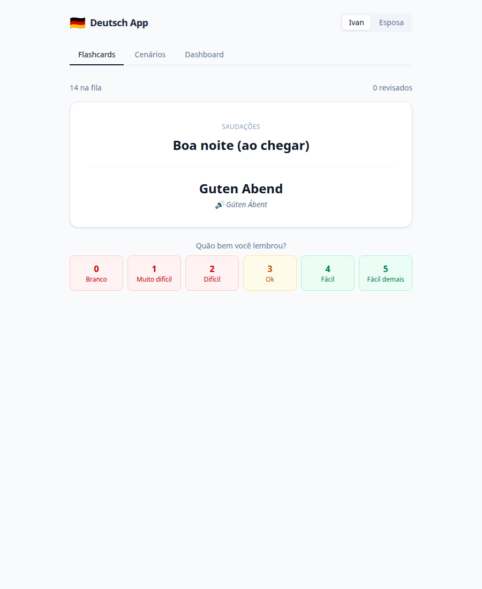
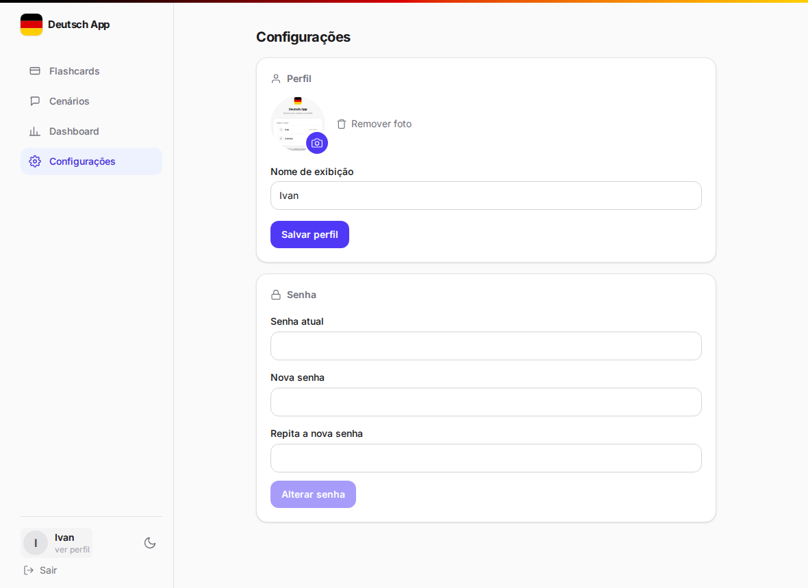
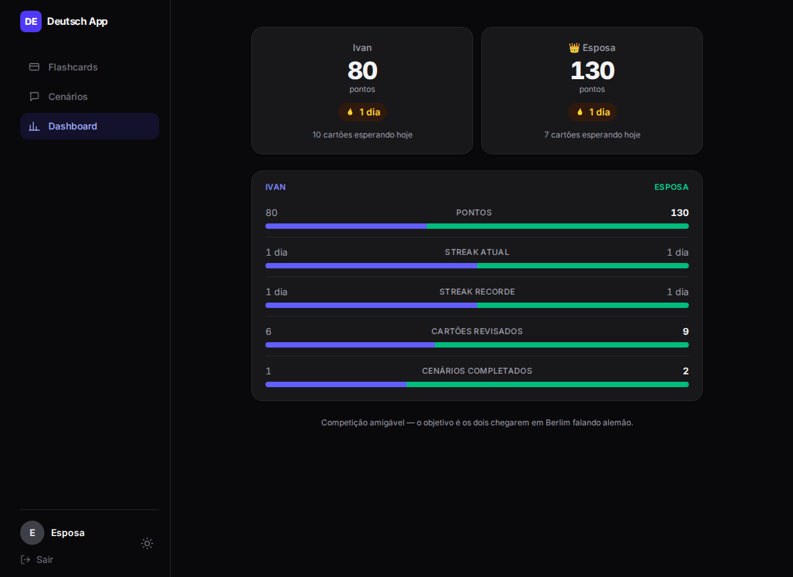

# Learning Languages

A personal app I built to learn German effectively ahead of a real move to Berlin —
and to have a genuine project in my portfolio while moving from database administration
into software development. It started German-only; English was added later, so the
app now carries a deck per language and you pick which one you're studying.

I study with it every day: spaced-repetition flashcards (SM-2), multiple-choice
roleplays of everyday situations (German bureaucracy — Anmeldung, opening a bank
account, apartment viewings; English — airport check-in, a job interview, a doctor's
visit), and a two-person progress dashboard my partner and I use for friendly
competition.

On the engineering side it's a full-stack app with a REST API, a real domain model,
tests, and a React frontend wired to it — not a pile of automation scripts.

> The app UI is in Portuguese on purpose: it teaches Portuguese speakers German and
> English. All code identifiers, commits and docs are in English.

**Live demo:** [app](https://app-deutsch-iota.vercel.app) · [API docs (Swagger)](https://deutsch-app-api.onrender.com/docs)
— on the app, click **"Entrar como visitante"** for a read-only tour, no signup.

> The API runs on Render's free tier, which sleeps after 15 min idle (first
> request then takes ~50s). A scheduled GitHub Action
> ([`keep-warm.yml`](.github/workflows/keep-warm.yml)) pings `/api/health` every
> 10 min to keep it awake; if it's been disabled, the frontend shows a
> "server waking up" message instead of a bare spinner.

## Screenshots

| Login (first-use claim) | Flashcards (SM-2) | Profile settings | Couple dashboard (dark) |
|---|---|---|---|
|  |  |  |  |

## Features

- **Spaced-repetition flashcards** — the SM-2 algorithm (the one Anki is based on),
  over a ~75-card German starter deck across 15 themes (numbers, time, family, food,
  transport, health, small talk…). Each card has a Portuguese phrase, its translation, and
  a homemade phonetic hint (`"Wie geht's"` → `"Ví guêts"`). Flipping a card speaks the
  answer aloud (browser `speechSynthesis`, adjustable speed). Cards can be shared or
  private, and the review schedule is **per user** — a shared card advances independently
  for each person. A per-user **daily goal** caps the review queue so a big pile isn't
  overwhelming; you can always choose to keep going past it.
- **Two languages** — the app also has an English deck (~35 cards, 3 scenarios). Right
  after login a quick screen asks which language you're studying (also changeable in
  Settings); the review queue, scenario list, text-to-speech and the UI accent colour
  (German → red, English → blue) follow it, and each language keeps its own SM-2 schedule.
- **Everyday-situation scenarios** — scripted dialogues (German: Anmeldung, bank, apartment
  viewing, doctor, supermarket, bakery, phone appointment; English: airport check-in, job
  interview, doctor's visit) with 2–3 multiple-choice replies. Picking a less natural
  answer shows *why* the better one fits.
- **Couple mode** — points, current/longest streak, cards reviewed today vs. the daily
  goal, total cards reviewed and scenarios completed for the two users side by side. All
  derived by SQL aggregation, no scoreboard table.
- **Accounts & profile** — JWT auth, a first-use password claim, a read-only guest role,
  plus a settings screen for the password, profile photo, daily goal, study language and
  voice speed.

## Tech stack

| Layer | Choice | Why |
|---|---|---|
| API | **FastAPI** + **Pydantic** | Type-checked request/response models and an OpenAPI schema (Swagger UI) generated from the code. |
| ORM | **SQLAlchemy 2.0** (typed `Mapped[...]`) | Explicit, commented models a reviewer can read top to bottom. |
| DB | **SQLite**, Postgres-ready | One env var (`DATABASE_URL`) switches engines — no code change. |
| Frontend | **React** + **Vite** + **Tailwind CSS** | SPA with a dev proxy to the API; utility CSS keeps styling in the component. |
| Tests | **pytest** + FastAPI `TestClient` | SM-2 unit tests plus endpoint tests on an isolated in-memory DB. |
| Deploy | **Render** (API) + **Vercel** (frontend), free tiers | Blueprint + zero-config SPA. |

## Project layout

```
backend/
  app/
    main.py        FastAPI app, CORS, startup migration, routers
    auth.py        argon2 hashing + JWT
    deps.py        session, current user, writer-only guard
    models.py      SQLAlchemy models (commented)
    schemas.py     Pydantic request/response contracts
    srs.py         SM-2 algorithm — pure, no framework
    scoring.py     points rules
    stats.py       streak + dashboard aggregation
    routers/       auth (login + profile) · languages · cards · reviews · scenarios · dashboard
    seed.py        loads app/data/seed_data.py
  tests/           pytest — SM-2, auth, and every endpoint
frontend/
  src/
    auth/          AuthContext — token + session (localStorage)
    lib/           api client, theme hook
    components/    Layout (sidebar + mobile tab bar), Logo, ui, icons
    pages/         Login · Welcome (study-language step) · Review · Scenarios · Dashboard · Settings
docs/
  DESIGN.md        schema, algorithm and API spec (written before the code)
```

The design doc — [`docs/DESIGN.md`](docs/DESIGN.md) — has the full schema, the SM-2
formula, the scoring rules and the endpoint list.

## Run it locally

Requires Python 3.11+ and Node 18+.

### Backend

```bash
cd backend
python3 -m venv .venv && source .venv/bin/activate
pip install -r requirements.txt
python -m app.seed                 # 3 accounts, ~110 cards (DE+EN), 10 scenarios, sample activity
uvicorn app.main:app --reload      # http://localhost:8000/docs
```

### Frontend

```bash
cd frontend
npm install
npm run dev                        # http://localhost:5173  (proxies /api to :8000)
```

### Tests

```bash
cd backend && pytest -q
```

Every push and pull request also runs these tests plus the frontend lint and
build in GitHub Actions ([`ci.yml`](.github/workflows/ci.yml)).

## API overview

Interactive docs at `/docs`. Auth is a JWT bearer token on every route except
`/api/health` and `/api/auth/*`. Registration is closed — the two accounts come
from the seed and each sets its own password on first use. A guest token gives
read-only access.

| Method | Path | Purpose |
|---|---|---|
| `GET` | `/api/auth/accounts` | the fixed accounts and whether each has a password yet |
| `POST` | `/api/auth/claim` · `/api/auth/login` | set the password on first use / log in — both return a token |
| `POST` | `/api/auth/guest` | read-only token for recruiters |
| `PATCH` | `/api/auth/me` · `POST /api/auth/change-password` | update name/photo/daily goal/study language · rotate the password |
| `GET` | `/api/languages` | study languages available (`de`, `en`) |
| `GET` | `/api/reviews/due` | the day's queue for the active language (capped to the daily goal; `?include_all=true` for everything) plus goal progress |
| `POST` | `/api/reviews` | submit a grade (0–5); runs SM-2, logs it, returns the next interval |
| `GET` | `/api/scenarios` · `/api/scenarios/{slug}` | list (active language) / detail with steps and options |
| `POST` | `/api/scenarios/{slug}/attempts` · `/api/attempts/{id}/answers` | start a playthrough / answer a step |
| `GET` | `/api/dashboard` | both users' progress side by side |
| `GET` | `/api/cards` + CRUD | manage flashcards |

## Deploy (free tier)

### Backend — Render

1. Push this repo to GitHub.
2. Render → **New +** → **Blueprint** → pick the repo. It reads [`render.yaml`](render.yaml).
   `CORS_ORIGIN_REGEX` already allows every `*.vercel.app` origin, so no post-deploy edit is needed.
3. Set `DATABASE_URL` (in the Render dashboard) to a managed Postgres connection string —
   [Neon](https://neon.tech) has a free, persistent tier. Paste the `postgresql://…` URL
   as-is; the app swaps in the psycopg 3 driver itself.

Render's free disk is ephemeral, so **without** an external database the SQLite file — and
every account password and study record — is wiped on each deploy. `SEED_ON_STARTUP=true`
keeps the reference data (accounts, cards, scenarios) in place; the seeders are idempotent,
so it's a no-op once the data exists.

### Frontend — Vercel

1. Vercel → **Add New** → **Project** → import the repo, **Root Directory** `frontend`.
2. Framework preset **Vite** is detected. Add an env var `VITE_API_URL` = your Render URL
   (no trailing slash), then redeploy so it's baked into the build.
3. [`vercel.json`](frontend/vercel.json) rewrites all routes to `index.html` for React Router.

## What this project demonstrates

- Designing a **normalised relational schema** for a non-trivial domain (per-user SRS
  state on shared content, scored multi-step quizzes) — and writing the spec before the code.
- A **REST API** with validated contracts, layered routing, auto-generated docs, and
  **JWT auth** — argon2 password hashing, first-use password claim, and a read-only
  guest role enforced by a dependency.
- Implementing a real **algorithm** (SM-2) as a pure, unit-tested module.
- **SQL aggregation** for the dashboard (points, streaks) instead of denormalised counters.
- A **React SPA** (Vite, Tailwind, React Router) with token auth, protected routes,
  light/dark theme, a responsive sidebar/tab-bar layout, and PWA install support.
- **Testing**: isolated in-memory DB, endpoint coverage of every feature, deterministic
  time-zone handling.

## Roadmap

- Alembic migrations (schema currently created with `create_all` + a small startup ALTER)
- Audio for pronunciation hints
